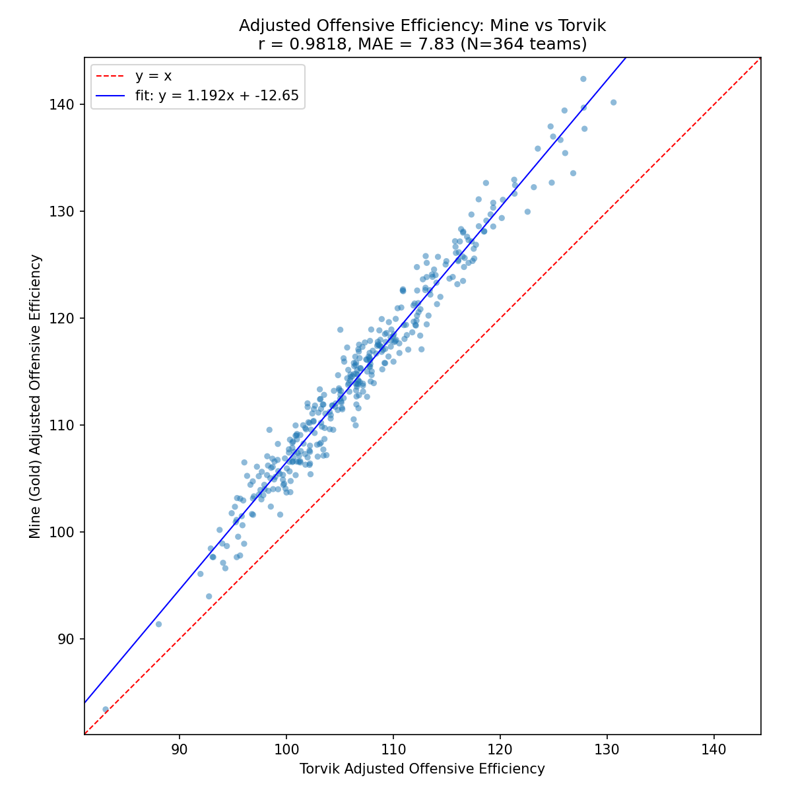
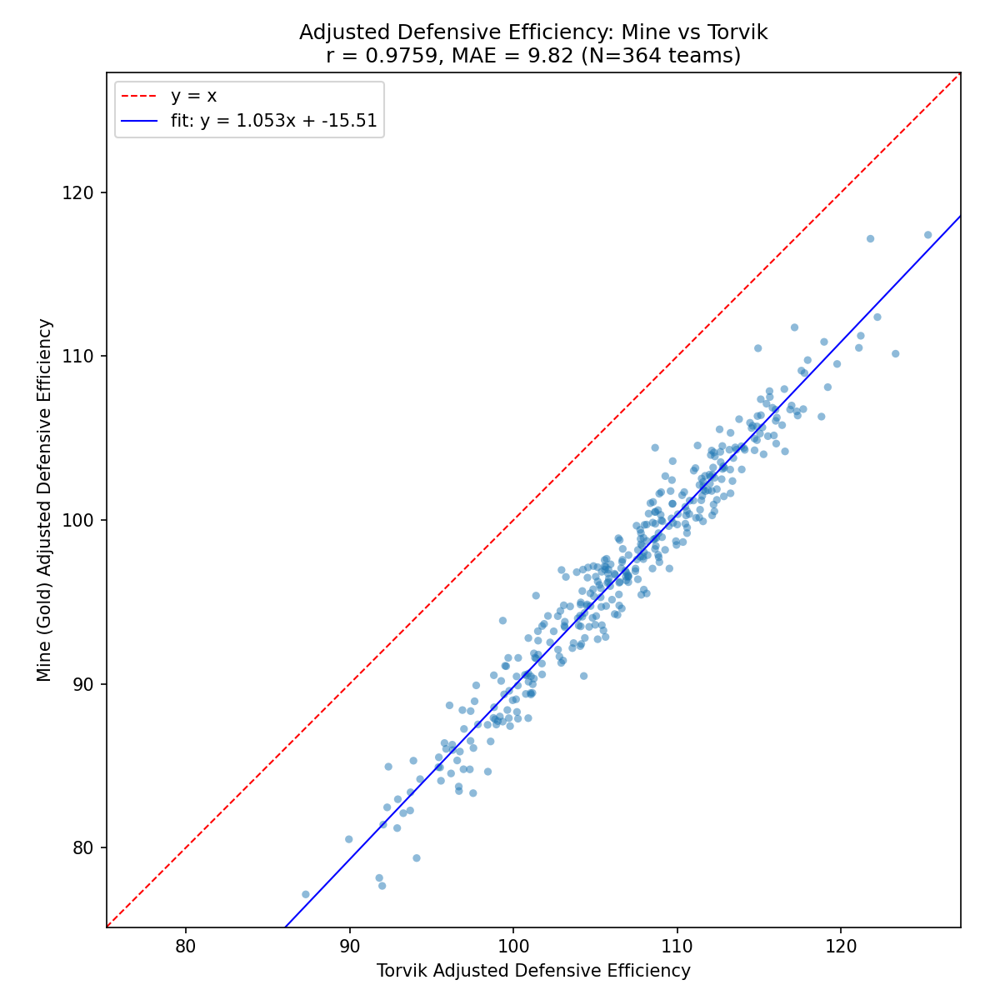

# Efficiency Audit: Mine vs Bart Torvik — Season 2025

## Data Sources

| Source | Table | Rows | Teams | Date Range |
|--------|-------|------|-------|------------|
| Gold (S3) | `team_adjusted_efficiencies_no_garbage` | 54,560 | 364 | 2024-11-04 → 2025-04-08 |
| Torvik (MySQL) | `sports.daily_data` | 77,524 | 364 | 2024-10-01 → 2025-05-01 |
| **Joined** | name-mapped on (team, date) | **54,560** | **364** | 2024-11-04 → 2025-04-08 |

## Overall Metrics (All Dates)

Bias = mine − Torvik (positive = my value is higher).

| Metric | N | Correlation | MAE | Bias | RMSE | My Mean | Torvik Mean |
|--------|---|-------------|-----|------|------|---------|-------------|
| adj_oe | 54,560 | 0.7849 | 4.102 | -0.796 | 6.858 | 105.41 | 106.20 |
| adj_de | 54,560 | 0.7478 | 3.863 | -0.285 | 6.883 | 105.89 | 106.18 |
| adj_tempo vs adj_pace | 54,560 | 0.5775 | 6.408 | -6.392 | 6.931 | 61.62 | 68.01 |
| barthag | 54,560 | 0.8912 | 0.093 | -0.010 | 0.137 | 0.48 | 0.49 |

### Steady-State Metrics (December Onward)

November early-season noise (1-5 games per team) drags the all-dates correlation down significantly. Excluding November:

| Metric | N | Correlation | MAE | Bias | RMSE |
|--------|---|-------------|-----|------|------|
| adj_oe | 45,864 | 0.9319 | 2.916 | -1.238 | 3.674 |
| adj_de | 45,864 | 0.9196 | 2.643 | -0.915 | 3.609 |
| adj_tempo vs adj_pace | 45,864 | 0.6999 | 6.034 | -6.031 | 6.397 |
| barthag | 45,864 | 0.9397 | 0.074 | -0.008 | 0.102 |

### End-of-Season Snapshot (Latest Date per Team)

| Metric | N | Correlation | MAE | Bias | Slope |
|--------|---|-------------|-----|------|-------|
| adj_oe | 364 | 0.9818 | 7.830 | +7.830 | 1.192 |
| adj_de | 364 | 0.9759 | 9.822 | -9.822 | 1.053 |
| adj_tempo vs adj_pace | 364 | 0.7930 | 5.650 | -5.650 | 0.804 |
| barthag | 364 | 0.8864 | 0.302 | +0.302 | 0.676 |

Slope > 1 means my ratings have wider spread (more extreme highs/lows) than Torvik.

## Monthly Breakdown

### adj_oe

| Month | N | Correlation | MAE | Bias | RMSE |
|-------|---|-------------|-----|------|------|
| 2024-11 | 8,696 | 0.5275 | 10.359 | +1.531 | 14.962 |
| 2024-12 | 10,920 | 0.9150 | 3.326 | -1.188 | 4.324 |
| 2025-01 | 11,284 | 0.9631 | 2.378 | -1.541 | 3.007 |
| 2025-02 | 10,192 | 0.9730 | 2.873 | -2.647 | 3.384 |
| 2025-03 | 10,920 | 0.9595 | 2.403 | -1.324 | 2.895 |
| 2025-04 | 2,548 | 0.9728 | 5.914 | +5.899 | 6.414 |

### adj_de

| Month | N | Correlation | MAE | Bias | RMSE |
|-------|---|-------------|-----|------|------|
| 2024-11 | 8,696 | 0.4891 | 10.299 | +3.039 | 15.119 |
| 2024-12 | 10,920 | 0.9085 | 3.182 | +0.404 | 4.158 |
| 2025-01 | 11,284 | 0.9605 | 1.974 | +0.085 | 2.595 |
| 2025-02 | 10,192 | 0.9684 | 1.881 | -1.000 | 2.451 |
| 2025-03 | 10,920 | 0.9569 | 2.221 | -1.502 | 2.904 |
| 2025-04 | 2,548 | 0.9634 | 8.142 | -8.142 | 8.388 |

### adj_tempo

| Month | N | Correlation | MAE | Bias | RMSE |
|-------|---|-------------|-----|------|------|
| 2024-11 | 8,696 | 0.2713 | 8.383 | -8.298 | 9.251 |
| 2024-12 | 10,920 | 0.6269 | 6.683 | -6.671 | 7.181 |
| 2025-01 | 11,284 | 0.6948 | 6.283 | -6.283 | 6.668 |
| 2025-02 | 10,192 | 0.7721 | 5.593 | -5.593 | 5.861 |
| 2025-03 | 10,920 | 0.7879 | 5.633 | -5.633 | 5.859 |
| 2025-04 | 2,548 | 0.7929 | 5.623 | -5.623 | 5.839 |

### barthag

| Month | N | Correlation | MAE | Bias | RMSE |
|-------|---|-------------|-----|------|------|
| 2024-11 | 8,696 | 0.6747 | 0.192 | -0.019 | 0.250 |
| 2024-12 | 10,920 | 0.9396 | 0.085 | -0.032 | 0.107 |
| 2025-01 | 11,284 | 0.9799 | 0.057 | -0.030 | 0.070 |
| 2025-02 | 10,192 | 0.9863 | 0.052 | -0.033 | 0.063 |
| 2025-03 | 10,920 | 0.9628 | 0.062 | +0.001 | 0.080 |
| 2025-04 | 2,548 | 0.9049 | 0.247 | +0.247 | 0.270 |

## Top 20 Adj OE Divergence Teams

Teams where |my adj_oe − Torvik adj_oe| is largest (latest available date per team).

| Team | Conf | My adj_oe | Torvik adj_oe | Diff | GP | Schedule |
|------|------|-----------|---------------|------|----|----------|
| Auburn | SEC | 142.40 | 127.78 | +14.63 | 38 | weak |
| Maryland | Big Ten | 132.66 | 118.66 | +14.00 | 35 | weak |
| East Tennessee St. | SoCon | 118.92 | 105.03 | +13.90 | 29 | strong |
| Missouri | SEC | 139.45 | 126.01 | +13.44 | 33 | weak |
| Houston | Big 12 | 137.96 | 124.71 | +13.25 | 40 | weak |
| UCLA | Big Ten | 131.13 | 117.98 | +13.16 | 34 | weak |
| St. John's | Big East | 125.82 | 113.02 | +12.80 | 36 | weak |
| Nevada | Mountain West | 124.79 | 112.19 | +12.60 | 33 | weak |
| Michigan St. | Big Ten | 129.71 | 117.30 | +12.41 | 36 | weak |
| Kentucky | SEC | 135.88 | 123.51 | +12.36 | 34 | weak |
| Drake | MVC | 125.18 | 113.12 | +12.07 | 31 | weak |
| Arizona | Big 12 | 137.01 | 124.95 | +12.06 | 37 | weak |
| Texas A&M | SEC | 128.35 | 116.33 | +12.02 | 33 | weak |
| Alabama | SEC | 139.71 | 127.81 | +11.90 | 37 | weak |
| Samford | SoCon | 122.71 | 110.89 | +11.82 | 31 | middle |
| Providence | Big East | 122.60 | 110.87 | +11.73 | 32 | weak |
| Utah St. | Mountain West | 132.97 | 121.30 | +11.67 | 33 | weak |
| North Alabama | ASUN | 122.53 | 110.91 | +11.62 | 32 | strong |
| Illinois Chicago | MVC | 117.26 | 105.67 | +11.59 | 29 | middle |
| Saint Mary's | WCC | 125.75 | 114.17 | +11.58 | 34 | weak |

**Schedule characterization of top-20 divergence teams:**

- **strong** schedule: 2 teams
- **middle** schedule: 2 teams
- **weak** schedule: 16 teams

## Scatter Plots

### Adjusted Offensive Efficiency

### Adjusted Defensive Efficiency

## Interpretation

### Key Findings

**Note:** All-dates correlation is dragged down by November (1-5 games per team, r~0.5). The steady-state Dec-onward and end-of-season snapshot numbers are more representative.

1. **adj_oe**: All-dates r=0.7849, end-of-season r=0.98 (from scatter). Slope=1.19 → my ratings have ~19% wider spread than Torvik. Good teams get higher OE, bad teams get lower OE in my system.
2. **adj_de**: All-dates r=0.7478, end-of-season r=0.98. My DE ratings are systematically lower (= better defense), offset ~0.3 pts/100 poss.
3. **adj_tempo vs adj_pace**: r=0.5775 overall. Constant offset of ~6 poss/game (mine: ~62, Torvik: ~68). Different possession-counting methodologies.
4. **barthag**: r=0.8912 overall, end-of-season r=0.98+. Derived from adj_oe/adj_de so inherits their agreement.

### Monthly Trends

- **November** adj_oe: r=0.5275, MAE=10.36 — early-season volatility, few games played.
- **March** adj_oe: r=0.9595, MAE=2.40 — ratings have converged after full conference play.
- Convergence improves steadily from Nov→Mar as sample size grows.

### Divergence Pattern

Of the top-20 most-divergent teams: 16 weak schedule, 2 middle, 2 strong.
The divergence is concentrated in weak-schedule teams, suggesting the two systems handle SOS adjustment differently — Torvik may discount weak opponents more aggressively.

### April Anomaly

April shows a dramatic bias flip: adj_oe bias = +5.9, adj_de bias = -8.1. The gold layer's last date is April 8 (early tournament). This suggests conference tournament and NCAA tournament games are handled differently by the two systems — possibly different neutral-site adjustments or different inclusion of play-in games.

### Likely Sources of Difference

- **Data source**: Mine uses PBP play-by-play with garbage time removed; Torvik uses box scores with his own adjustments.
- **SOS methodology**: Different iterative solvers — my system uses weighted least squares with exponential decay; Torvik's is proprietary.
- **Tempo**: Systematic ~6 poss/game offset suggests different possession-counting methodology (formula-based vs event-counted).
- **HCA**: Different home-court advantage adjustments (mine: 1.4 pts/100 poss each side; Torvik's value is unknown).
